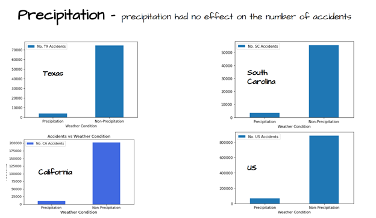
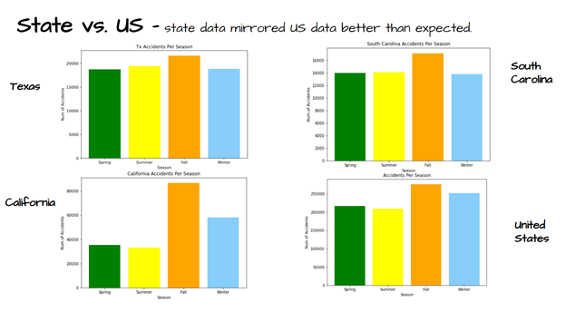

## U.S. Traffic Accident Trends
### Melissa Ruiz, Victoria Cruz, Andrew Zamora
 

#### Description:
The goal of our project is to uncover patterns in U.S. traffic accidents. We'll examine relationships between types of traffic accidents related to weather conditions; trends in accidents over the course of the year; relationships of types of cars to number of accidents; and related questions, as the data admits.

* Outline:
1. Use population census to find 3 similar cities to conduct research over. (using census bureau api)
2. Clean up traffic accident dataset to locate and find the cities of reference.
3. Use data to analyze questions below.
4. Create one Jupyter Notebook per question (each person will have three notebooks).
5. Create final notebook and final presentation.
   
* What we want to find out:
 1. Is there a correlation between accidents and season of the year?
 2. Which season has the higher % of accidents in 2019.
 3. Are there more accidents when there is lower visibility?
 4. Does precipitation affect the number of car accidents.

* Resources:
 1. Kaggle: US Accidents (3.5 million records)
 2. Open Weather API
 3. Census package - https://github.com/datamade/census/blob/master/census/tests/test_census.py
 4. Census population file - http://www2.census.gov/programs-surveys/popest/datasets/2010-2019/national/totals/nst-est2019-popchg2010_2019.csv?#
 5. Census population file - https://www.census.gov/data/tables/time-series/demo/popest/2010s-state-total.html
